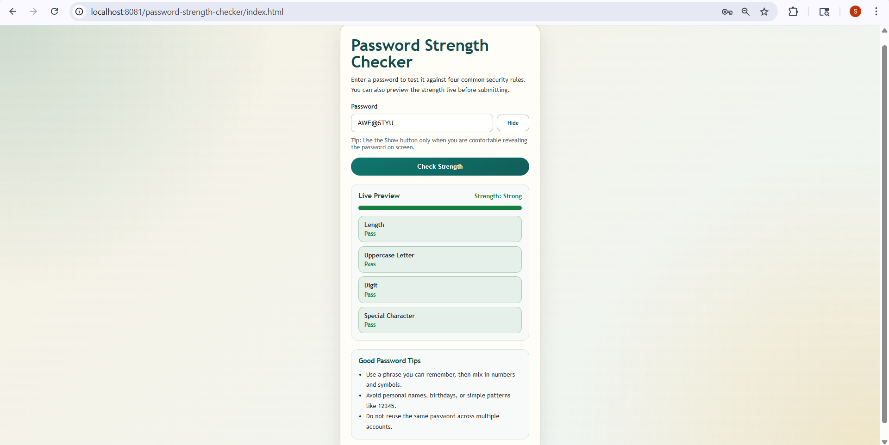
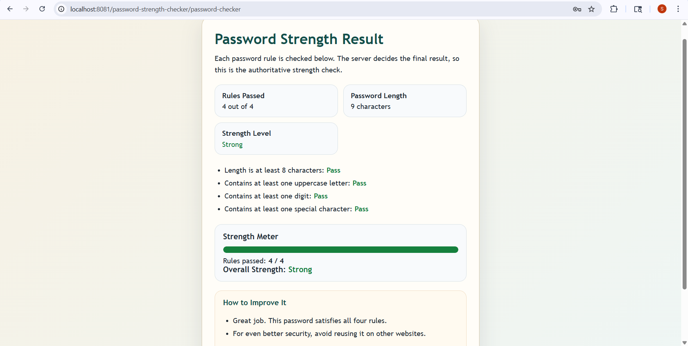

**Name:** Spoorti Arakeri

**USN:** 2BL23CS193

**Project Title:** Password Strength Checker

**Unique Feature:**
A standout feature of this project is its **real-time validation with dual-level checking (client + server)**. It not only gives instant feedback as users type (live preview), but also performs a final authoritative check on the server side, ensuring higher security, accuracy, and protection against manipulation or bypassing of validation rules.

**Tech Stack**

This project is developed using Java Servlets for backend processing, HTML for structuring the user interface, and XML for configuration and request mapping. Apache Tomcat is used as the server to deploy and run the application. The system performs password validation on the server side, ensuring secure processing, while the frontend provides a simple and interactive interface for users to check password strength efficiently.

Clean and password strength checker interface displaying real-time validation, progress bar, and security tips. The tool evaluates length, uppercase letters, digits, and special characters, providing instant feedback and a strong rating. Designed for simplicity, it helps users create secure passwords while understanding essential cybersecurity practices through guidance and visual indicators.

Password strength result interface showcasing detailed validation outcomes, including rules passed, character length, and overall strength rating. The visual strength meter highlights a strong password, while individual checks confirm compliance with security criteria. Clear feedback and improvement tips guide users toward maintaining robust, secure, and reliable password practices across platforms.
